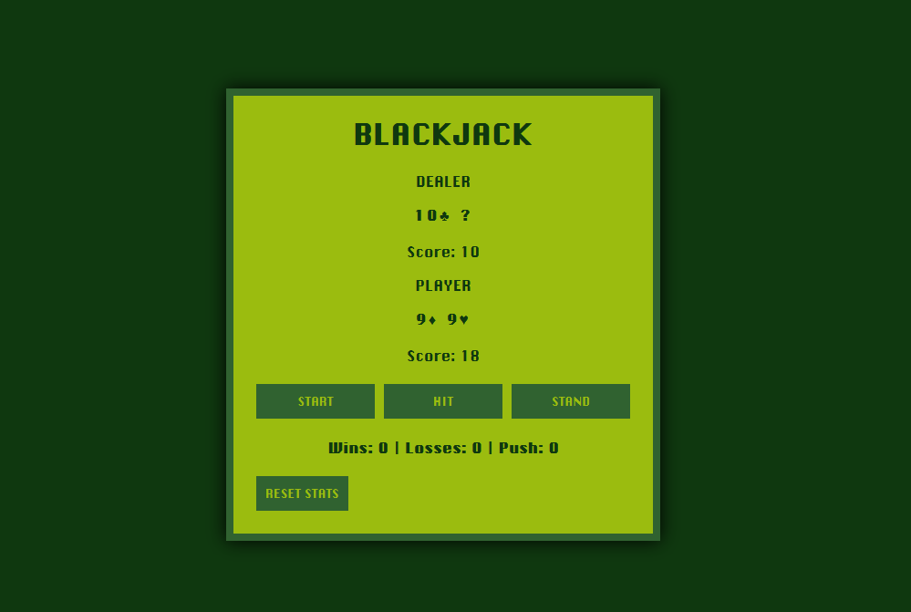
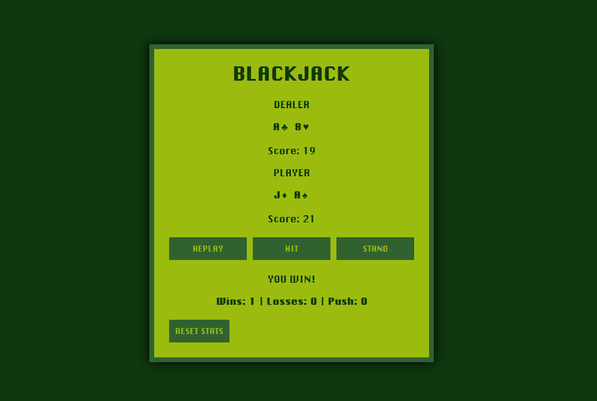
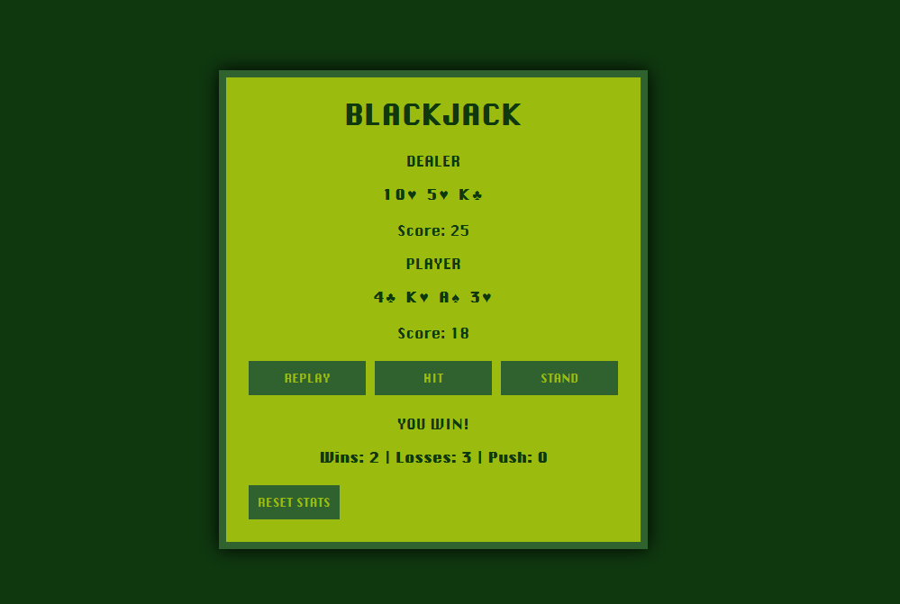
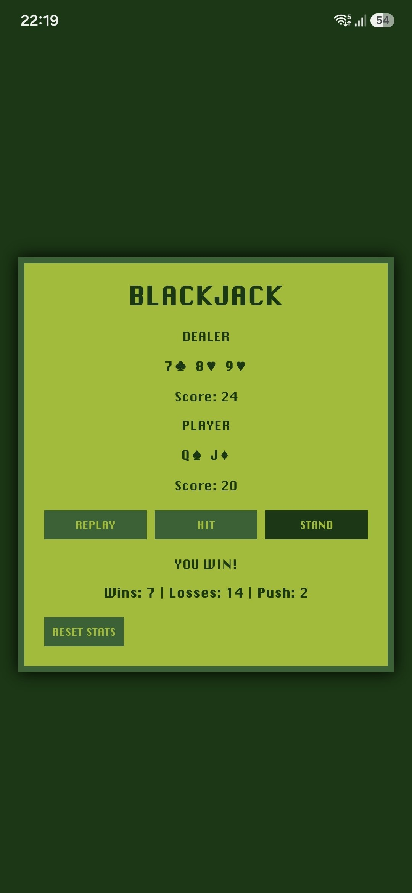

# Blackjack

A simple Blackjack game built with HTML, CSS and JavaScript.
This was made so I can play blackjack on my phone without downloading any apps with ads

## Features

- Blackjack rules
- Responsive interface
- Progressive Web App (PWA)
- Offline support

## Technologies

- HTML
- CSS
- JavaScript

## Screenshots

<h3>Desktop</h3>

  <strong>Home Screen</strong> 
  

  <strong>Winner Screen</strong> 
  

  <strong>Statistics</strong> 
  

<h3>Mobile PWA</h3>

  <strong>Installable Progressive Web App</strong> 
  

## Live Demo

[https://hachi99.github.io/blackjack-gb/]
